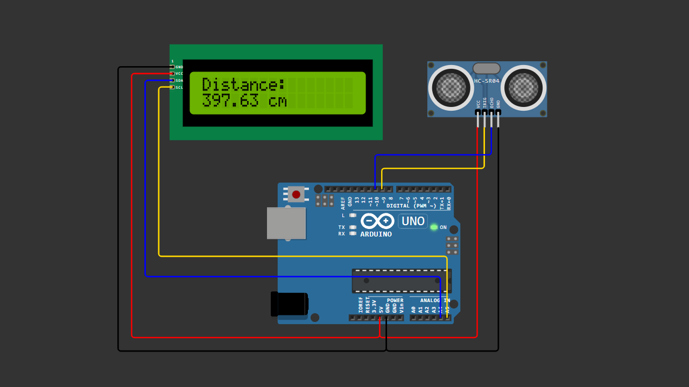

# Arduino LCD I2C Distance Display

A beginner-friendly Arduino project that measures distance using an ultrasonic sensor and displays the result on a 16x2 LCD using an I2C module.

This project shows how to combine a sensor and a display so the measured distance can be viewed directly without opening the Serial Monitor.

---

## 📌 Project Overview

In this project, an HC-SR04 ultrasonic sensor measures the distance between the sensor and an object.

Instead of sending the data only to the Serial Monitor, the measured distance is displayed on a 16x2 LCD screen using an I2C module.

When an object moves closer or farther from the sensor, the LCD updates the distance value in real time.

This project is designed to be simple and beginner-friendly, helping you understand how sensors and displays work together in Arduino.

---

## 🧰 Components Required

- Arduino Uno / Nano  
- HC-SR04 Ultrasonic Sensor  
- LCD 16x2 with I2C Module  
- Jumper Wires  
- Breadboard (optional)  

---

## 🔌 Wiring Connections

### Ultrasonic Sensor

| HC-SR04 | Arduino |
|--------|--------|
| VCC | 5V |
| GND | GND |
| TRIG | Pin 9 |
| ECHO | Pin 10 |

### LCD I2C

| LCD I2C | Arduino |
|--------|--------|
| VCC | 5V |
| GND | GND |
| SDA | A4 |
| SCL | A5 |

---

## 📷 Wiring Diagram

> Make sure your wiring matches the diagram above before uploading the code.

---

## 💻 Arduino Code

You can download the Arduino sketch here:

[Download Arduino Code](arduino-lcd-i2c-distance-display.ino)

Or open the `.ino` file directly inside this repository.

---
 
## 🚀 Getting Started

1. Connect all components according to the wiring table.
2. Upload the provided Arduino sketch to your Arduino board.
3. The LCD will initialize and display a title.
4. Place an object in front of the ultrasonic sensor.
5. The LCD will display the measured distance in centimeters.

---

## 🧠 Learning Concepts

This project helps you understand:

- Ultrasonic distance measurement
- Pulse duration reading with `pulseIn()`
- Distance calculation formula
- I2C communication
- LCD display control
- Real-time sensor data display

---

## 🔄 Possible Improvements

You can expand this project by adding:

- Distance warning with buzzer
- LED indicator for near/far distance
- OLED display instead of LCD
- Multiple sensors for obstacle detection
- Distance logging to SD card

---

## 🎥 Video Tutorial

Watch the full step-by-step tutorial on YouTube:

👉 https://youtu.be/YOUR_VIDEO_LINK

In this video, you will see:

- Complete wiring demonstration  
- Arduino code explanation  
- LCD display testing  
- Real-time distance measurement  

If this project helps you, consider subscribing for more beginner-friendly Arduino tutorials 🚀

---

## 📄 License

This project is open-source and free to use for educational purposes.

---

Happy Coding 🚀
